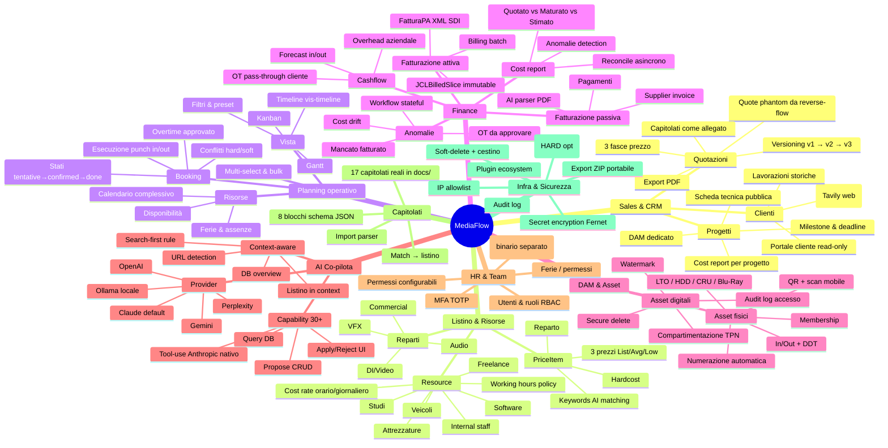
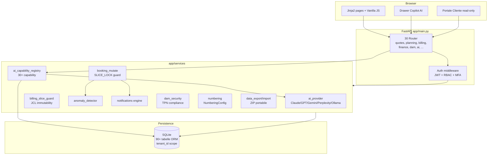
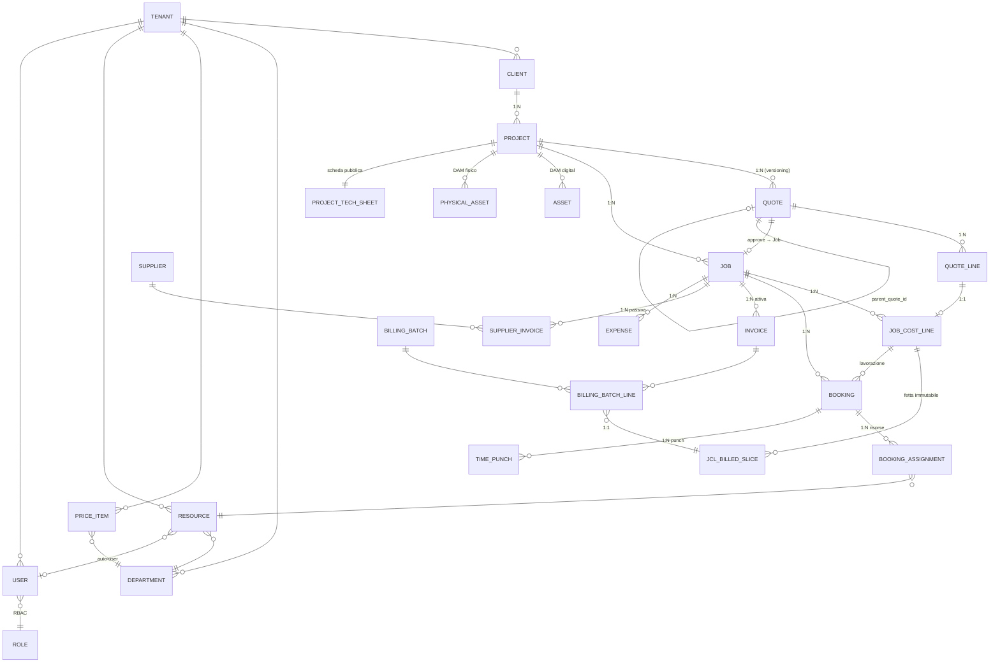
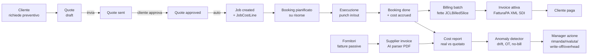
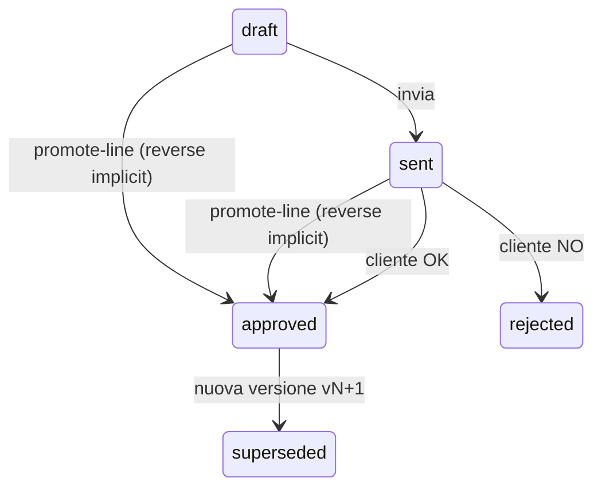
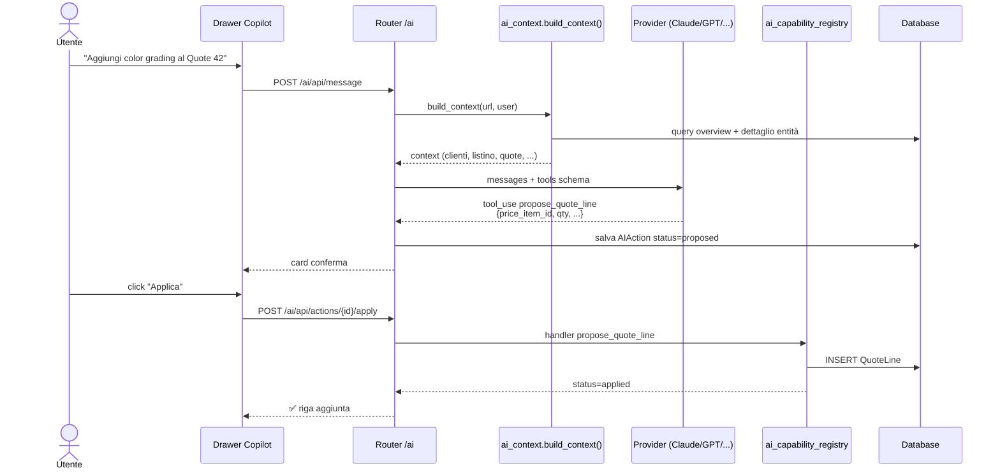
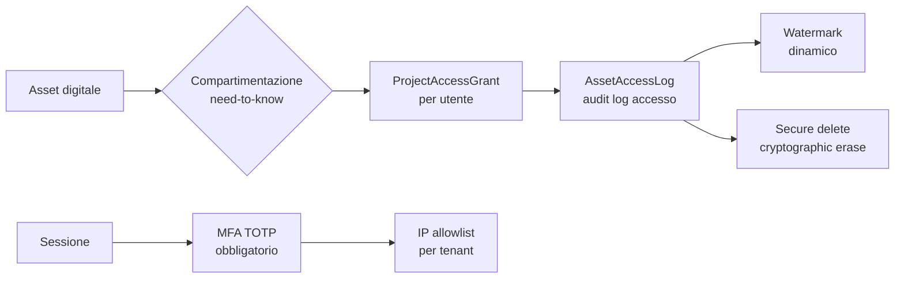
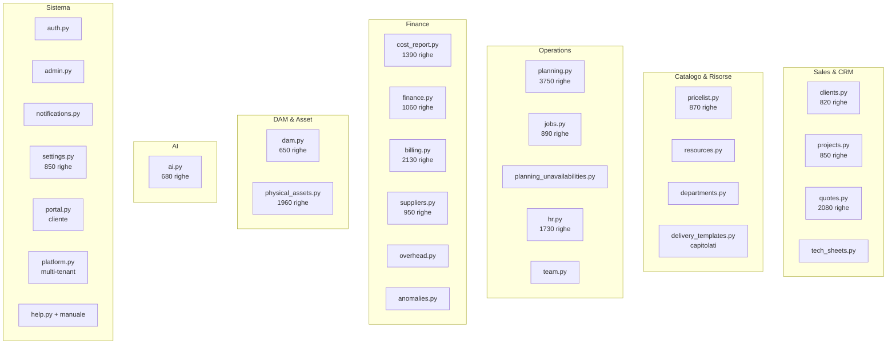

# MediaFlow — Architettura del Progetto

> Documento di sintesi per condivisione con team / colleghi.
> Versione di riferimento: **v3.5.0-alpha.118** (15 maggio 2026).
> Linguaggio: italiano. Formato: Markdown + diagrammi Mermaid (rendering nativo su GitHub, VS Code, Obsidian, GitLab, Notion).

---

## 1. Cos'è MediaFlow in una pagina

MediaFlow è una **piattaforma gestionale per case di post-produzione audiovisiva** (color grading, VFX, audio mixing, finishing, mastering, delivery) con un **AI co-pilota integrato** lungo l'intero ciclo di lavoro.

Non è un CRM generico, né un project management tool: è pensato per il **modello operativo specifico della post-produzione**, dove convivono:

- **Quotazioni complesse a tre fasce** (List / Average / Low) con sconto pacchetto e voci hardcost.
- **Capitolati di consegna** ipertecnici (Netflix, Sky, RAI, A24, BBC, Vision, Amazon MGM, NBCU TechOps, MUBI, BETA Film, Fremantle…) — 17 capitolati reali coperti.
- **Risorse miste** umane + studi + attrezzature + software, ciascuna con un costo orario/giornaliero diverso.
- **Planning a slot** con conflitti, ferie, straordinari approvati, billing del tempo.
- **Cost report continuo** Quotato / Maturato / Stimato che si aggiorna da booking, fatture passive, expense, overhead aziendali.
- **Compliance TPN** (Trusted Partner Network, MPA) per la sicurezza dei contenuti pre-uscita.

### Tre principi non negoziabili

1. **AI propone, utente dispone.** Ogni azione AI passa da una `AIAction` con stato `proposed → applied | rejected | failed`. Tracciabilità completa, niente "magia".
2. **Funziona senza AI.** L'AI è co-pilota, non condizione di funzionamento. Disattivarla non rompe nulla.
3. **Listino, reparti, capitolati sono parametri**, non costanti hardcoded. Ogni casa di post ha i suoi, e il sistema si adatta.

---

## 2. Mindmap — Visione complessiva

---

## 3. Stack tecnico

| Layer | Tecnologia | Note |
|------|-----------|------|
| Backend | **FastAPI** + Uvicorn | API REST + server-render Jinja2 |
| Persistence | **SQLAlchemy 2.0** ORM + **SQLite** | `Mapped[type]` + `mapped_column`, no Alembic (migrazioni script-based) |
| Frontend | **Jinja2** + **Vanilla JS** + CSS variabili | Nessun React/Vue/build step. `static/js/global.js` helper centralizzati |
| Timeline / planning | **vis-timeline 7.x** | Con quirks documentati (HTMLElement, _tlSetSel, no stack:true su volumi alti) |
| Auth | **PyJWT** + **bcrypt diretto** + **MFA TOTP** | No `python-jose`, no `passlib` |
| AI provider | **Claude / OpenAI / Gemini / Perplexity / Ollama** | Astrazione `ai_provider.py`, switch da UI per utente |
| PDF | **ReportLab** | Quote PDF, fattura PDF — no WeasyPrint |
| Web search | **Tavily** | Arricchimento clienti + AI capability `web_search` |
| Encryption | **cryptography.fernet** | API key AI cifrate, `AI_KEY_ENCRYPTION_KEY` separata da `SECRET_KEY` JWT |
| Distribuzione | Cartella eseguibile offline (Mac/Win) | Python 3.11–3.14, no admin required |

**LOC indicativi** (v3.5.0-alpha.118):
- `app/models/models.py` → ~2 700 righe (90+ entità ORM)
- `app/routers/*` → ~25 000 righe (30 router)
- `app/services/*` → ~50 servizi business
- `app/templates/pages/*` → 41 pagine

---

## 4. Architettura a layer

**Principi:**
- **Tenant scope obbligatorio**: ogni query filtra per `tenant_id` (default 1). Multi-tenant HARD opzionale in Fase 7.
- **Permission gate** su 100% delle mutazioni: 76/76 mutator hanno RBAC check (audit α.66.16).
- **Soft-delete** ovunque: `is_active=False` o `deleted_at`, recuperabili da `/admin/trash`.
- **Form-based API**: i POST/PUT usano `Form(...)`, non JSON. Frontend invia `FormData`.

---

## 5. Modello dati — vista d'insieme

Vista semplificata. ER completa in `docs/data-model.md`.

### Entità chiave (semantica)

| Entità | Ruolo |
|--------|------|
| `Tenant` | Casa di post-produzione (1 per default, predisposto per N) |
| `Client` | Committente (broadcaster, distributor, agenzia) |
| `Project` | Lavoro per il cliente (es. "Color Movie X — DI") |
| `Quote` / `QuoteLine` | Offerta economica, può avere versioni e phantom |
| `Job` / `JobCostLine` | Quote approvato → Job esecutivo, JCL = singola lavorazione costabile |
| `Booking` / `BookingAssignment` | Slot temporale assegnato a risorse, eseguito con punch |
| `Resource` | Persona interna, freelance, studio, attrezzatura, software, veicolo |
| `Invoice` / `BillingBatch` | Fatturazione attiva, raggruppa fette `JCLBilledSlice` immutabili |
| `SupplierInvoice` | Fatturazione passiva, costa al progetto, parser AI |
| `Asset` / `PhysicalAsset` | DAM digitale e fisico (LTO/HDD/Blu-Ray) — modelli **separati** |
| `AIAction` | Proposta AI tracciata, `proposed → applied/rejected/failed` |
| `AnomalyEntry` | Incongruenza rilevata (drift costo, mancato fatturato, OT…) con workflow stateful |
| `Notification` | Eventi sistema → utenti, motore generico |

---

## 6. Flusso operativo — dal preventivo al pagato

### Sotto-flussi rilevanti

#### 6.1 Versioning Quote

#### 6.2 Reverse-flow ("Job nasce da Quote sempre")
Se un booking viene creato fuori dal flusso normale (urgenza, on-the-fly), il sistema crea automaticamente una **phantom Quote** con `is_phantom=true` per mantenere l'invariante `Job ⟸ Quote`.

#### 6.3 JCL Billed Slice — fatture immutabili
Quando una fattura attiva viene emessa, la quota di `JobCostLine` fatturata viene "congelata" in `JCLBilledSlice`. Non può più essere modificata, garantisce coerenza tra cost report e libro fatture. **HARD-BLOCK** (HTTP 409) se si tenta di ridurre quantità sotto le fette già fatturate.

---

## 7. AI Co-pilota

L'AI è un **drawer laterale** (FAB 💬 in basso a destra) presente su tutte le pagine. Capisce la pagina su cui sei (`/projects/{id}`, `/quotes#{id}`, `/jobs/{id}`) e adatta il contesto.

### Capability registrate (estratto da `@ai_capability` decorator)

**Mutator (`propose_*`)** — passano sempre da Apply/Reject:
- CRUD entità: `propose_client`, `propose_project`, `propose_project_metadata`, `propose_resource`, `propose_supplier`, `propose_price_item`
- Quote: `propose_quote`, `propose_quote_line`, `propose_new_item_and_line`, `propose_quote_from_template`, `update_quote`
- Planning: `propose_booking`, `propose_recurring_bookings`, `propose_move_booking`, `propose_resize_booking`, `propose_delete_booking`, `propose_bulk_move`
- Asset: `propose_asset_movement`
- Finance: `propose_supplier_invoice`, `propose_transmit_to_billing`
- Settings: `update_setting`

**Query (read-only)** — esecuzione immediata:
- `query_project_finance`, `query_suppliers`, `query_supplier_invoices`, `query_physical_assets`, `query_asset_contents`
- `analyze_conflicts`, `find_free_slots`
- `list_settings_schemas`, `read_setting`
- `web_search` (Tavily)

### Search-first rule
Quando l'utente chiede di aggiungere voci a quote, l'AI cerca **prima nel listino** (le voci attive sono nel context fino a 200). Solo se nessun match → `propose_new_item_and_line` (Scenario C). Riduce duplicati e mantiene il listino come fonte di verità.

---

## 8. Compliance & Sicurezza

### Trusted Partner Network (TPN/MPA)

Suite implementata per soddisfare i requisiti dei major studios per la sicurezza dei contenuti pre-rilascio:

- **Audit log**: ogni accesso a asset registrato (`AssetAccessLog`).
- **Watermark**: marcatura dinamica delle preview.
- **Secure delete**: cancellazione cryptografica delle copie.
- **MFA**: TOTP via `mfa.py` su login.
- **IP allowlist**: per tenant, configurabile.
- **Compartimentazione**: `ProjectAccessGrant` granulare per utente.

### Encryption secrets

| Cosa | Come |
|------|------|
| Password utente | `bcrypt` diretto, no `passlib` |
| Sessione | JWT firmato `SECRET_KEY` |
| API key AI per-utente | `Fernet` con `AI_KEY_ENCRYPTION_KEY` separata, in `UserAISettings` |
| `.env` | Untracked dal 12 maggio 2026 (rischio leak API key) — usa export ZIP per portabilità |

---

## 9. Plugin ecosystem & Multi-tenant

### Plugin
Architettura plugin avviata (sessione 12 maggio 2026): consente di aggiungere capability o report custom senza toccare il core. Pattern simile a `@ai_capability` per tools.

### Multi-tenant
- **Soft**: ogni entità ha `tenant_id`, queries filtrano. Funzionante da v3.0.
- **Hard**: separazione fisica per onboarding/billing/dominio. Rimandato a **Fase 7** (commercializzazione).

### Portabilità dei dati
- **Export ZIP**: `/settings → Dati` genera uno zip importabile con DB + asset.
- **Snapshot**: cartella `db_snapshots/` per backup pre-operazioni rischiose.
- **Branding**: logo/nome/colori configurabili per tenant.

---

## 10. Mappa dei moduli (per area funzionale)

---

## 11. Stato di avanzamento

### Fasi completate

| Fase | Versione | Cosa | Stato |
|------|---------|------|-------|
| **1** | v2.1 | Gerarchia Cliente/Progetto/Quote/Job + listino base + auth | ✅ |
| **1-bis** | v3.0 | Tenant + Reparti + DeliveryTemplate + keywords + UI rivista | ✅ |
| **2 step A+B** | v3.2.1 | AI per-utente live + Copilot drawer + 8 capability prime | ✅ |
| **3 (parziale)** | v3.4.x | Arricchimento cliente Tavily + AI tool-use Anthropic nativo | ✅ |
| **4** | v3.4.x | Resource timeline + Kanban + Gantt + RBAC + permessi config | ✅ |
| **5** | v3.4.x | Cestino completo + retention auto + soft-delete UNIQUE bypass | ✅ |
| **6** | v3.5.0-alpha | TPN compliance + supplier 360° + capitolati↔quote + cashflow + 11 seed template + PhysicalAsset logistics + anomalie stateful + numbering config | ✅ |

### Versione attuale: v3.5.0-alpha.118
- **6 round di audit consecutivi** (α.113 → α.118): >80 fix/feature, deep-dive su immutability, race condition, tenant sweep, NumberingConfig.
- 371 route attive, 90+ entità ORM.
- Stress test: 1k progetti, 80k punch, AI E2E 9 query Claude — superato.

### Prossimi passi (post v3.5.0-alpha.118)
1. Test estensivi Matteo su checklist post-audit.
2. Bug emersi da uso reale.
3. **Fase 5 capitolati F14/F15**: cablare `deliverables_parser` in UI dedicata, test sui 17 capitolati reali.
4. **Capability AI avanzate**: cross-check web automatico, integrazione email/Drive/Office (OAuth), filesystem Asset Library, automazione portali consegne.
5. **Rebrand** (il nome "mediaflow" è già preso): working title finché non si decide.
6. **Mobile** (PWA scope ridotto): staff operativo + finance read-only + planning lista. Niente drag timeline mobile.
7. **Fase 7 multi-tenant HARD**: opzionale, per commercializzazione.

---

## 12. Convenzioni di codice (riassunto)

- **Lingua**: codice in inglese, commenti e UI in **italiano**.
- **SQLAlchemy 2.0**: `Mapped[type]` + `mapped_column`. No ORM legacy.
- **Tenant filter** in cima a ogni router: `CURRENT_TENANT = 1`.
- **Form-based API** non JSON: `Form(...)` lato server, `FormData` lato client.
- **Soft-delete**: `is_active=False` o `deleted_at`. Cestino in `/admin/trash`.
- **Migrazioni**: script idempotenti in `scripts/migrate_*.py`. No Alembic.
- **Python**: 3.11+, priorità 3.14. No `python-jose`, no `passlib`, no `WeasyPrint`.
- **Frontend**: Vanilla JS in `static/js/global.js` con helper `api()`, `openModal()`, `closeModal()`, `toast()`, `escapeHtml()`.
- **No JSON.stringify in onclick**: antipattern silently-broken. Usa `data-*` attributes.
- **Cache-buster**: bump `?v=` in `base.html` quando si modificano file in `static/js/*`.
- **Auto-migrate**: aggiungere colonna a modello → check in `_auto_migrate_columns()` di `main.py` lifespan, altrimenti crash su DB esistenti.
- **Commit a fine versione**: bump `app/main.py` `version=` + CHANGELOG + commit nello stesso giro. Push remoto sempre.

---

## 13. File di riferimento per chi vuole approfondire

| File | Cosa |
|------|------|
| `CLAUDE.md` | Visione strategica e contesto progetto |
| `docs/STATO.md` | Snapshot operativo aggiornato a ogni iterazione |
| `CHANGELOG.md` | Storia versione per versione |
| `docs/data-model.md` | ER completo + flag/stati |
| `docs/workflow.md` | Diagrammi di flusso (Quote, Booking, Job, Billing) |
| `docs/permissions-matrix.md` | Matrice RBAC ruoli × azioni |
| `docs/audit-e2e-report.md` | Report audit deep-dive |
| `docs/stress_test_report.md` | Report stress 1k progetti |
| `docs/capitolati_esempio/` | 17 capitolati reali per test |
| `app/models/models.py` | Tutte le entità ORM |
| `app/services/ai_capability_registry.py` | Pattern per nuove capability AI |
| `app/main.py` | Wire FastAPI + lifespan + auto-migrate |
| `scripts/seed_demo.py` | Setup demo + listino esempio |
| `scripts/migrate_phase1bis.py` | Pattern per migrazioni non distruttive |

---

## 14. Glossario rapido

| Termine | Significato |
|---------|-------------|
| **JCL** | JobCostLine — singola lavorazione costabile dentro un Job |
| **JCLBilledSlice** | Fetta di JCL fatturata, **immutabile** (HARD-BLOCK 409 su modifiche) |
| **Phantom Quote** | Quote `is_phantom=true` creata da reverse-flow per mantenere invariante |
| **Reverse-flow** | Job nasce sempre da Quote; se manca, ne creo una phantom |
| **SLICE_LOCK** | Guard centralizzata `booking_mutate.py` per coerenza booking↔JCL |
| **Reconcile** | Background job che sincronizza cost report con stato reale (dirty flag pattern) |
| **TPN** | Trusted Partner Network — standard di sicurezza MPA per major studios |
| **DAM** | Digital Asset Management — gestione media (digitali e fisici, **modelli separati**) |
| **OT pass-through** | Straordinario del booking ripercosso sul cliente (toggle `weighted_revenue`) |
| **NumberingConfig** | Generatore configurabile codici doc (Quote, Job, BillingBatch, DDT, ecc.) |
| **AIAction** | Singola proposta AI con stato `proposed → applied/rejected/failed` |
| **Search-first** | L'AI cerca prima nel listino prima di proporre voci nuove |

---

*Documento generato il 16 maggio 2026 a partire da v3.5.0-alpha.118.*
*Per aggiornamenti continui, riferirsi a `docs/STATO.md` e `CHANGELOG.md`.*
