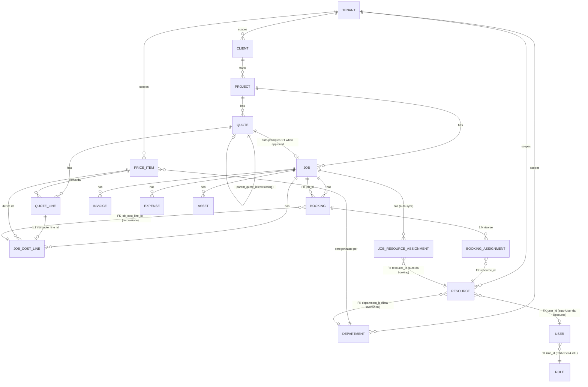

# MediaFlow — Data model

> ER delle entità chiave + flag/stato. Mermaid `erDiagram` (rendering nativo GitHub).
>
> Aggiornato a v3.4.56.

---

## Entità business



---

## Flag e stati chiave

```mermaid
classDiagram
    class Quote {
        +int id
        +string number "Q-2026-NNN o Q-...-vN"
        +int version
        +int parent_quote_id "versioning"
        +int superseded_by_id "v_old → v_new"
        +bool is_phantom "v3.4.52 — reverse-flow"
        +QuoteStatus status "draft, sent, approved, rejected, superseded"
        +float total_with_vat
    }

    class Job {
        +int id
        +string code "{PROJECT_CODE}-J{N}"
        +int quote_id "nullable: legacy floating jobs"
        +JobStatus status "draft, approved, active, completed, invoiced, cancelled"
        +float budget_quoted
    }

    class JobCostLine {
        +int id
        +int quote_line_id "nullable per extra"
        +int price_item_id
        +bool is_extra "v3.4.9 — aggiunta dopo approval"
        +bool is_billable
        +string unit "day, hour, piece, lump"
        +float quantity_quoted
        +float quantity_actual "sync da booking done"
        +float unit_price
        +float total_quoted
        +float total_accrued "auto = qty_actual × unit_price"
    }

    class Booking {
        +int id
        +int job_id
        +int job_cost_line_id "lavorazione collegata"
        +datetime start_datetime "shell envelope"
        +datetime end_datetime
        +BookingStatus status "tentative, confirmed, cancelled"
        +BookingExecutionStatus execution_status "planned, in_progress, done, not_done"
        +BookingPriority priority "low, normal, high"
        +bool count_in_costs "v3.4.32"
        +OvertimeStatus overtime_status "none, pending, approved, rejected"
        +datetime original_end_datetime "se esteso"
    }

    class BookingAssignment {
        +int id
        +int booking_id
        +int resource_id
        +datetime start_datetime "può differire da shell"
        +datetime end_datetime
    }

    class JobResourceAssignment {
        +int id
        +int job_id
        +int resource_id "auto-sync v3.4.55"
        +string role_in_project
        +float agreed_daily_rate
        +float planned_days
    }

    Quote "1" --o "0..1" Job : promotes
    Job "1" --o "*" JobCostLine
    Job "1" --o "*" Booking
    Job "1" --o "*" JobResourceAssignment
    Booking "1" --o "*" BookingAssignment
    JobCostLine "1" --o "*" Booking : "FK opzionale"
```

---

## Decisioni architetturali fissate

| Decisione                                 | Versione  | Memoria                                       |
| ----------------------------------------- | --------- | --------------------------------------------- |
| Quote → Job 1:1 (auto promote)            | v3.4.8    | —                                             |
| `JobCostLine.is_extra` per lavorazioni post-approval | v3.4.9 | — |
| Multi-resource Booking via BookingAssignment | v3.4.16 | — |
| Cost report fonte = Booking, NON Timesheet | v3.4.33 | `project_costreport_vs_timesheet.md`         |
| `Quote.is_phantom` per reverse-flow       | v3.4.52   | `project_reverse_quote_flow.md`              |
| Job nascosto da UI booking (parla Quote+Lavorazione) | v3.4.53 | `project_reverse_quote_flow.md` |
| HARD-BLOCK delete con booking attivi      | v3.4.55   | `project_integrity_invariants.md`            |
| Auto-assignment Resource → Job via booking | v3.4.55  | `project_integrity_invariants.md`            |
| Maturato in man-hours (sum assignments)   | v3.4.55   | `project_integrity_invariants.md`            |
| Notify `quote_approved_no_resources`      | v3.4.56   | (questo file)                                |
| Pre-save confirm su nuove risorse al job  | v3.4.56   | (questo file)                                |

---

## Convenzioni FK

- `*_id INTEGER NULL REFERENCES ...` — nullable di default per consentire soft-detach mirato
- Cascade `all, delete-orphan` solo dove la dipendenza è esistenziale (es. `Job.cost_lines`)
- TimePunch ha `job_cost_line_id` nullable, viene soft-detached su delete (HR separato dal cost report)
- Booking ha `job_cost_line_id` nullable solo per legacy/`kind=internal_*`. Per `kind=project` v3.4.53+ è obbligatorio (UI)

---

## Tenant scoping (multi-tenant SOFT)

Tutte le entità business hanno `tenant_id` (default=1). Le query nei router partono con `filter(X.tenant_id == CURRENT_TENANT)`. Quando si farà multi-tenant HARD (Fase 7 opzionale), `CURRENT_TENANT` diventerà dependency injection.
