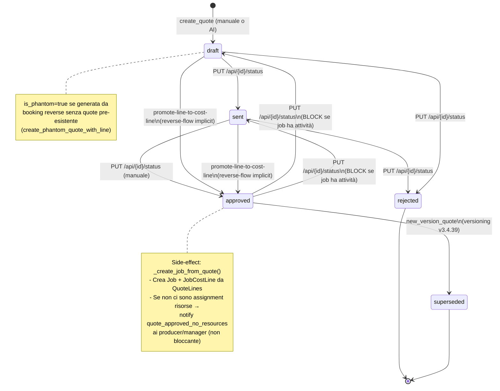
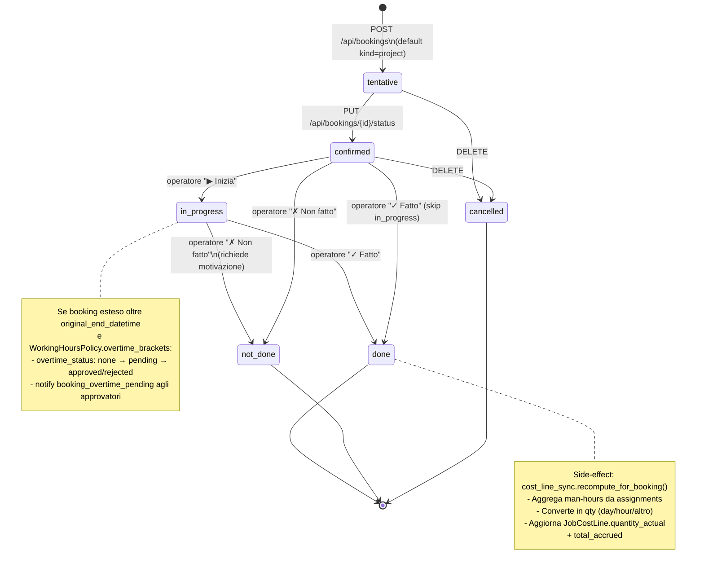
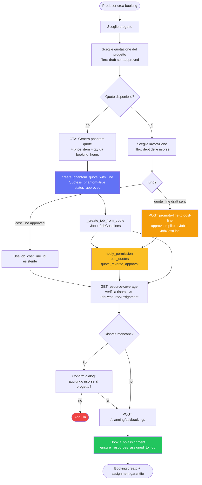
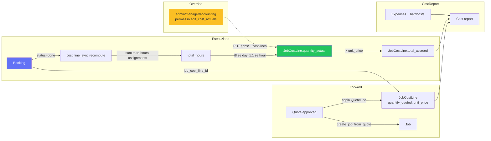
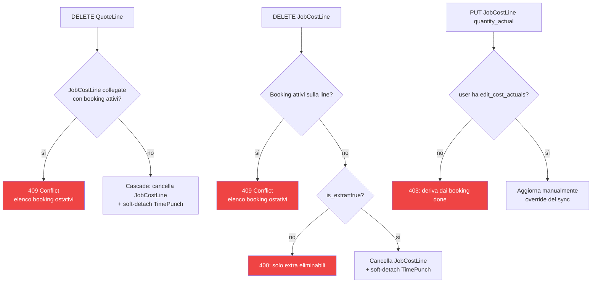

# MediaFlow — Workflow chart

> Diagrammi di flusso. Mermaid renderizza nativamente in GitHub e in molti viewer markdown.
> Per export PNG/SVG: `npx -p @mermaid-js/mermaid-cli mmdc -i docs/workflow.md -o docs/workflow.svg`.
>
> Aggiornato a v3.4.56 (3 maggio 2026).

---

## 1. Lifecycle Quote

---

## 2. Lifecycle Booking

---

## 3. Flusso Booking → Job (forward + reverse + phantom)

---

## 4. Cost report — fonti del Maturato

---

## 5. Vincoli di integrità (HARD-BLOCK)

